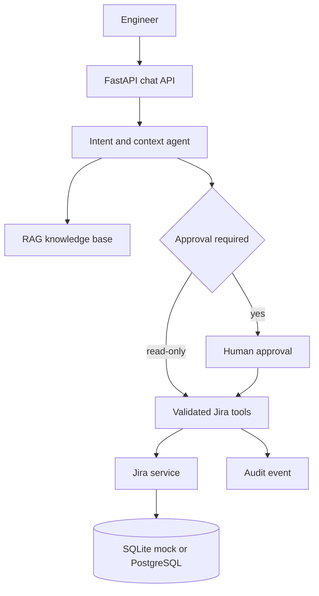
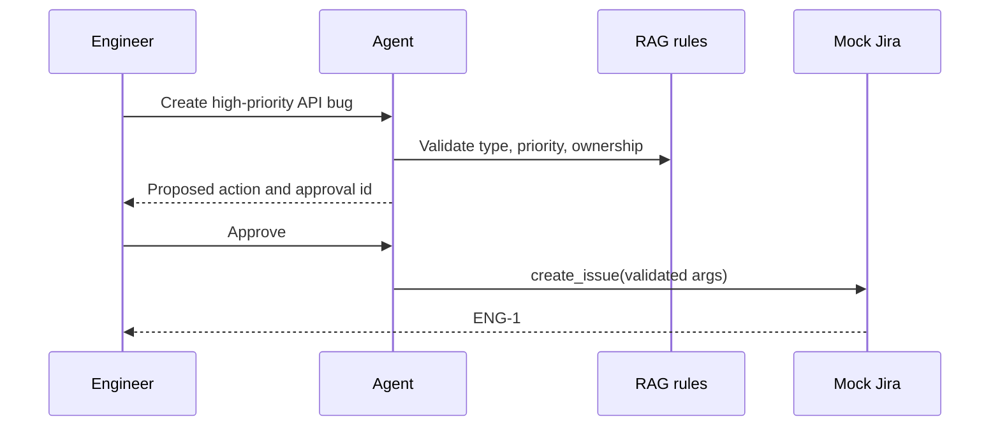

# AI Engineering Assistant with Jira Integration

**Status: Completed portfolio implementation**

**Status: Completed portfolio implementation**

Portfolio project: a mock-first agent that interprets engineering requests, retrieves project rules, proposes Jira actions, asks for human approval, and executes validated tools against a Jira-like store.

## Problem and architecture

Engineers can use natural language for routine ticket work without giving an LLM direct database access. The default mode is entirely local and contains no real Jira URL, credentials, ticket, or project data.



## Agent workflow and tool calling

The agent supports `CREATE_ISSUE`, `SEARCH_ISSUES`, `GET_ISSUE`, `UPDATE_ISSUE`, `COMMENT`, `ASSIGN`, `TRANSITION`, `SUMMARIZE`, and `GENERAL_QUERY`. Mutating actions produce a pending approval. Pydantic models validate all tool arguments; the agent never receives a database handle or SQL capability.

Available tools are `create_issue`, `get_issue`, `search_issues`, `update_issue`, `add_comment`, `assign_issue`, `transition_issue`, and `get_project_info`.



## RAG and security

`app/rag/knowledge.py` contains rules for projects, issue types, priorities, workflow transitions, team ownership, and incident SOPs. It is deterministic for local reproducibility and is the replacement point for a vector store.

The service has bearer-token-ready authentication, authorization dependency wiring, Pydantic validation, approval IDs, prompt-injection-resistant tool boundaries, audit records, request IDs, and explicit refusal of unsupported destructive requests such as “delete all tickets”. Store secrets in `.env`; never commit them.

## Run locally

```powershell
python -m venv .venv
.\.venv\Scripts\Activate.ps1
pip install -r requirements.txt
Copy-Item .env.example .env
uvicorn app.main:app --reload
```

API docs: http://localhost:8000/docs. The default uses SQLite and seeded mock project `ENG` with demo users. In a second terminal, run `streamlit run streamlit_app/app.py` for the UI.

## API

`GET /health`, `POST /api/v1/chat`, `POST /api/v1/approve`, `POST /api/v1/issues`, `GET /api/v1/issues/{key}`, `GET /api/v1/search`, plus update, comment, assign, and transition issue routes.

Example:

```powershell
Invoke-RestMethod http://localhost:8000/api/v1/chat -Method Post -ContentType application/json -Body '{"message":"Create a high priority bug for payment API timeout"}'
```

## Tests and evaluation

```powershell
python -m pytest -q
python evaluation/run_evaluation.py
```

The evaluation set contains 30 scenarios and reports intent/tool selection accuracy, hallucination rate, failure recovery coverage, and a latency measurement note. Add provider-backed latency samples when configuring an OpenAI-compatible endpoint.

## Docker

```powershell
docker compose up --build
```

The API is on port 8000, Streamlit on 8501, and PostgreSQL on 5432. Mock mode remains enabled in Compose.

## Screenshots

Run the Streamlit app locally and capture chat, approval prompt, and issue search states for the repository README. The app intentionally ships without fabricated screenshots or real Jira branding/data.

## Sample conversations

```text
User: Create a bug for payment API timeout
Agent: Approve create issue with HIGH/MEDIUM priority and summary ...?
User: Approve
Agent: Create Issue completed for ENG-1.

User: Show my open bugs
Agent: Found 0 issue(s).

User: Delete all tickets
Agent: I can help with Jira issues, but bulk destructive deletion is not supported.
```

## Limitations and roadmap

The default classifier is deterministic and intentionally small; OpenAI-compatible settings are reserved for a production provider adapter. Approval state is process-local, so production deployments should use Redis or a database-backed workflow. Future work: OAuth/JWT identity, embeddings/vector retrieval, webhook sync, rate limits, streaming responses, and richer evaluation traces.

## Portfolio and interview notes

Resume bullets:

- Built a mock-first FastAPI and Streamlit engineering assistant with validated Jira tools, SQLAlchemy persistence, approval gates, audit logging, and 30-case evaluation coverage.
- Designed a provider-agnostic agent boundary that keeps LLMs away from SQL and enforces Pydantic schemas, workflow validation, auth, and human-in-the-loop controls.

System design explanation: the API is the trust boundary; the agent classifies and retains context; RAG supplies policy context; tools are typed capabilities; the service owns business rules; PostgreSQL provides durable state; audit events provide observability. Scale the stateless API horizontally and move sessions/approvals to Redis or PostgreSQL.

Interview questions: How do you prevent prompt injection from reaching tools? How are approvals idempotent? What happens on an invalid transition? How do you evaluate tool selection? How would you swap SQLite for PostgreSQL? Where would retries and rate limits live? How do you redact audit payloads? How would you ground an LLM response in RAG evidence?

## Resume Relevance

Demonstrates FastAPI, Streamlit, Python, Pydantic validation, typed tool boundaries, approval workflows, RAG-style policy retrieval, SQLite/PostgreSQL persistence, audit logging, Docker, and evaluation design.

## Author and Related Work

**Sunil Javadi** · [GitHub](https://github.com/suniljavadi) · [Portfolio](https://github.com/suniljavadi/sunil-portfolio) · [LinkedIn](https://www.linkedin.com/in/sunil-javadi/)

- [AI Agent + Jira Integration](https://github.com/suniljavadi/AI-Agent-Jira-Integration)
- [Multi-Agent Data Engineering Assistant](https://github.com/suniljavadi/Multi-Agent-AI-Data-Engineering-Assistant)
- [Data Engineering MCP Server](https://github.com/suniljavadi/data-engineering-mcp-server)

## Local Git Workflow

```powershell
git add .
git commit -m "Build AI engineering assistant with mock Jira"
git push origin main
```